CEE 224X | Released: 180925 | Due: 181002

# Assignment 1: Orientation

Note: Keep track of roughly how much time each part of the assignment takes you. We need this feedback to calibrate the size of assignments moving forward. 

<!-- TOC depthFrom:2 depthTo:6 withLinks:1 updateOnSave:1 orderedList:0 -->

- [Part 1: Tech Setup](#part-1-tech-setup)
	- [GitHub](#github)
	- [Google Drive](#google-drive)
	- [Visit our SUS Lab in Spatial Analysis Center](#visit-our-sus-lab-in-spatial-analysis-center)
	- [Slack](#slack)
	- [Facebook Group](#facebook-group)
	- [Map to S Drive](#map-to-s-drive)
		- [On PC](#on-pc)
		- [On Mac](#on-mac)
	- [Cisco VPN](#cisco-vpn)
	- [Microsoft Office for students](#microsoft-office-for-students)
		- [Excel](#excel)
	- [Download R+RStudio and/or Python+Anaconda](#download-rrstudio-andor-pythonanaconda)
		- [Python+Anaconda](#pythonanaconda)
		- [R+RStudio](#rrstudio)
	- [Mac Users: Bootcamp](#mac-users-bootcamp)
	- [ArcGIS Desktop](#arcgis-desktop)
	- [ArcGIS Online](#arcgis-online)
	- [Stanford Web Hosting](#stanford-web-hosting)
- [Part 2: Pre-Assessment](#part-2-pre-assessment)
- [Part 3: Practice Data Dive](#part-3-practice-data-dive)
	- [First Pass: Excel and ArcMap](#first-pass-excel-and-arcmap)
		- [Q1: What are the “Combined” fields referring to? How do you think this information may affect our analyses?](#q1-what-are-the-combined-fields-referring-to-how-do-you-think-this-information-may-affect-our-analyses)
		- [Q2: Why are the “Average” fields likely not useful for our analyses?](#q2-why-are-the-average-fields-likely-not-useful-for-our-analyses)
		- [Q3: What is the total KBTU combined electricity and gas consumption in PG&E territory in 2017? What is the average annual electricity consumption per customer, and average annual gas consumption per customer?](#q3-what-is-the-total-kbtu-combined-electricity-and-gas-consumption-in-pge-territory-in-2017-what-is-the-average-annual-electricity-consumption-per-customer-and-average-annual-gas-consumption-per-customer)
		- [Q4: How would you explain the results of this chart to an average property owner in Northern California? What would be the value of conducting further "seasonal" analyses of energy use, compared to "year-long" analyses, and how would you define seasonal boundaries?](#q4-how-would-you-explain-the-results-of-this-chart-to-an-average-property-owner-in-northern-california-what-would-be-the-value-of-conducting-further-seasonal-analyses-of-energy-use-compared-to-year-long-analyses-and-how-would-you-define-seasonal-boundaries)
		- [Q5: Explain your choice of formula for "avgkbtu".](#q5-explain-your-choice-of-formula-for-avgkbtu)
		- [Q6 Paste a publicly viewable link to your Slides.](#q6-paste-a-publicly-viewable-link-to-your-slides)
		- [Q7 In what ways do the results in or in the vicinity of your chosen zip code validate or contradict your expectations?](#q7-in-what-ways-do-the-results-in-or-in-the-vicinity-of-your-chosen-zip-code-validate-or-contradict-your-expectations)
		- [Q8 Any other reactions to completing Pass One? What was especially challenging or surprising in the workflow? How might you expand on this analysis if you had more time?](#q8-any-other-reactions-to-completing-pass-one-what-was-especially-challenging-or-surprising-in-the-workflow-how-might-you-expand-on-this-analysis-if-you-had-more-time)
	- [Second Pass: R/Python](#second-pass-rpython)
		- [Q9 How would you compare the experienced or apparent work involved, as well as the usefulness of the outcome, of Pass One vs. Pass Two? How would you rate the difficulty of this assignment?](#q9-how-would-you-compare-the-experienced-or-apparent-work-involved-as-well-as-the-usefulness-of-the-outcome-of-pass-one-vs-pass-two-how-would-you-rate-the-difficulty-of-this-assignment)
		- [Q10 In total, how long did Assignment 1 take?](#q10-in-total-how-long-did-assignment-1-take)

<!-- /TOC -->

## Part 1: Tech Setup

**Objective**: Set up the various technologies used throughout the course. This is a lot of banal software installation, but absolutely critical for creating the optimal working environment to succeed in this course. We think you'll also be pleasantly surprised by how much cool free stuff you get access to as a Stanford student.

Note: Tech setup will be happening to SUS Lab computers Friday afternoon. You should plan to do A1 on your own laptop so you get comfortable using the software (and stress test your machine).

### GitHub

Even though programming is optional in this course, we want every student to become familiar with the industry-standard Git workflow, so we're going to manage all of our assignments through GitHub. The key benefits are:

- Strong version control capabilities, which is a key principle in all project work.
- Easy management of assignments through GitHub Classroom.
- When you are ready to make the jump to programming, you will be much more familiar with the workflow.
- Once you are using a scripting language, you have significant advantages over more manual data work in Excel or ArcGIS such as debugging, increased automation, iteration and scaling capabilities, reproducibility for reviewers, publishing, and, perhaps most importantly, access to open-source APIs, libraries, and communities to greatly expand the power of your data work.

If you haven't used GitHub or coded before, the landing page of a typical GitHub repository may be overwhelming at first, but by the end of A1 you should have no problem navigating the various interlinked tools.

1. If you're viewing this, you've already created a [GitHub](https://github.com/) account. As a student, you are entitled to a free developer account (the standard personal account) and a number of other goodies.
2. You are viewing this README.md file within a "repository" which is basically a folder of items. When you accepted the assignment invitation, you cloned the contents of a master repository. If this is your first time on GitHub, just first observe that you are scrolling through a README.md text document, but at the top is a list of repository contents which includes README.md and other things. GitHub just happens to automatically display the contents of a README file on the main repository page, but you can interact with all the other repository files like you would any other platform. .md files are "markdown" files which are the prose format of choice for GitHub.
3. To become familiar with the Git workflow, we recommend that you complete the “[Hello, World](https://guides.github.com/activities/hello-world/)” example on GitHub.
4. GitHub Desktop allows you to interact with GitHub in a very friendly GUI as opposed to the traditional command line interface. For those of you new to Git and GitHub, this is the recommended means of interacting with Git and GitHub as it’s quite easy to do. Download [here](https://desktop.github.com/).
5. We also recommend editing .md files using Atom, a desktop script editor, which can be downloaded <a href="https://atom.io/">here</a>. You can set Atom as your default editor which can be called straight out of GitHub desktop (for PC, `Ctrl+Alt+A`). Within, Atom, there are a few incredibly useful Packages that you should install by going to File > Settings > Install, and can toggle using the "Packages" dropdown or associated keyboard shortcut:
	- `markdown-preview` should already be installed, and allows you to see a live preview of what your script will look like in GitHub. This makes editing even more fluid than on a web browser.
	- `markdown-scroll-sync` if you want the GitHub preview to match your location in the script.
	- `quickhyperlink` allows you to easily add links to your script. You copy the URL from a separate browser, then highlight the text in your script you want to hyperlink, and use a keyboard shortcut (Ctrl+Alt+L on PC).
	- `markdown-image-assistant` makes embedding images very easy. You can copy and paste into the script and the package will create a copy of the image in a folder called "assets" directly in your repository. Under package settings you can set the image to embed as HTML which allows you to more easily adjust image size.
	- `markdown-toc` creates a table of contents at the top of your document which automatically refreshes with links to your headers on each save. It's what we use to create the table of contents on this document.
	- If there's some feature you think you want, you are likely to find a solution in a package that you can install. The same is likely true for coding in R or Python in general.

### Google Drive

With the exception of assignments on GitHub, your "224X" Google Drive should be considered your "home base" for course materials, particularly stream-of-consciousness notetaking and project management.

1. You will receive invitations to two folders:

	* "Course Materials" is view-only and will have primary course materials like the syllabus and lecture slides.
	* "Collaborative Materials" can be edited and is where we will collaborate on documents, sheets, and presentation slides, often in-class.

2. When you first receive the invitations, the two folders will be in your "Shared With Me" folder. Select them and "Add to My Drive". Then create a "New Folder" called "224X", "Star" it, and nest the two folders within the parent folder. You are then free to create other private nested folders within 224X. This should be the most efficient organization of your Drive content.

3. If you want us to invite a separate email address (likely your gmail address), just send us a note on Slack.

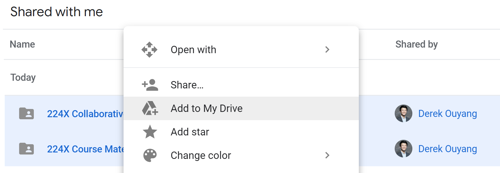

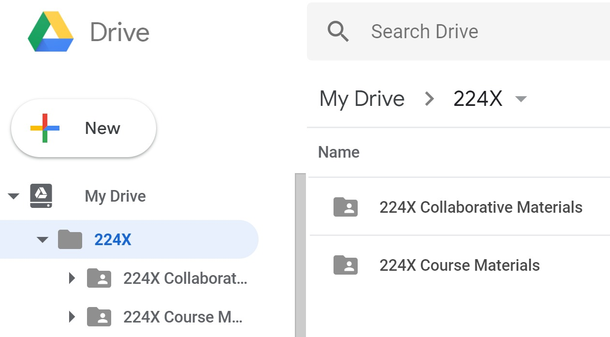

### Visit our SUS Lab in Spatial Analysis Center

We have a dedicated computer lab which is a small cozy room with three machines. It's got a pretty well-stocked SUS Library as well (from which you are welcome to borrow books, just let Derek know so he can log it), and SUS students are welcome to make it their own with wall art, snacks, etc. If the three machines are being used, there's usually no problem at all to spill out into the main lab space which is shared with other students. We will host our lab sessions here. We recommend you get into the habit of working here generally, as you'll appreciate the dual screens and the community that forms.

1. 3rd floor of Y2E2, Room 366D (key code 531175, keep this noted on your phone), small room at corner furthest away from main door.
2. You have priority use of these workstations, which are by far the fastest machines for you to do computational analysis on.
3. Practice signing on with the Bitlocker PIN (Dell key on the top of the tower + 12345) and user password "stanfordsus".
4. **On any of the computers (SUS1, SUS2, SUS3), you will find a spreadsheet called “General Orientation” on the desktop, top right corner. Please sign in on that spreadsheet with your name and complete the few cells of questions asked of you. That's all that's required for now.**
5. Note that in the future if you are running long analyses overnight on a machine, you should put a note on a piece of paper in front of the monitor.

### Slack

Slack is our primary communication platform (replacing email). If you haven't used it before, you will find yourself a quick convert.

1. Join SUS Slack team [here](https://join.slack.com/t/stanfordsus/signup).
2. You’ll want to be on #general, #224x, and eventually other channels.
3. Install on your computer and enable desktop notifications.
4. Install on your phone and enable mobile notifications.
5. If you do the two things above, we recommend you get rid of email notifications.

### Facebook Group

This is optional but highly recommended. I will usually post interesting online articles on FB only.

1. Request to join [here](https://www.facebook.com/groups/131125703997444/).

### Map to S Drive

This a Stanford network drive that is shared across all students and is storage for all raw data files used in the project. Examples of benefits:
- You can work with massive datasets without clogging up your own machine's hard drive.
- You can publish code online that can be reviewed by anyone, but run only on Stanford's network because data references point to the S Drive. This is especially important when we use restricted data.

Most content is "read only" on the S Drive, but you will be able to save your own data into your personal folder under "224X". Keep in mind that the S Drive is shared across all students, so be careful not to alter others' content.

#### On PC

1. On top tab of My PC file window, click “Map network drive”, type in \\\files.stanford.edu\sdc-sus$, then put in WIN\[SUNet ID] and password

#### On Mac

 1. From the Mac Finder, hit Command+K to bring up the "Connect to Server" window, enter smb://files.stanford.edu/sdc-sus$, then put in WIN\[SUNet ID] and password.

### Cisco VPN

A VPN is essential if you live off campus to access the S Drive, ArcGIS license, SimplyAnalytics, etc., but everyone should get it for the occasional times you’re working away from Stanford.

1. Download [here](https://uit.stanford.edu/software/vpn).

### Microsoft Office for students

1. Click [here](http://web.stanford.edu/dept/its/cgi-bin/services/software/portal/detail.php?action=view_product&product_id=1641) to access the online software portal you can use to download Office for free. If the link appears broken, follow the steps below.

	1. Click [here](http://web.stanford.edu/dept/its/cgi-bin/services/software/portal/detail.php) to be brought to the Software at Stanford page.
	2. Search for "Microsoft Office"" and navigate to "Microsoft Office for Stanford Students"
	3. In the "Where to get on campus" box, click the link next to "For Student Personal Purchase". This will bring you to the 3rd party vendor Stanford uses to distribute academic software.
	4. Once on the 3rd party site, search again for "Microsoft Office". On this site, you’ll have to add Office to your cart and "Purchase" it. However, as a student you are entitled to a free license on your personal machine.

#### Excel

1. Install Excel and Start Application.
2. File > Options button near the bottom of the dropdown menu.
3. On the window that opens up, click “Add-ins” on the left pane.
4. At the bottom of the window, there’s a title that says “Manage” and a dropdown menu next to it.
5. In this dropdown menu, make sure “Excel Add-ins” is selected. Click “Go…”
6. In the box that pops up, make sure “Analysis ToolPak” and “Solver Add-in” are checked. Click “Ok”.
7. If the add-ins are not currently installed, Excel will do that. You should then be good to go.

### Download R+RStudio and/or Python+Anaconda

As long as there are interested students, we will provide guidance on optional tracks to complete each assignment in R or Python (though you should also be expecting to be doing a lot of self-driven learning, as all coding requires, online). Basically, if you have plenty of prior experience in Excel and/or ArcGIS methods and find you are familiar with all the methods there, then you should be taking this class as an opportunity to hone a new programming language.

For the programming track, we will be focusing on R and Python, and recommending the following developer software for each. Follow the appropriate instructions below to download your preferred computing environment.

#### Python+Anaconda

1. Click [here](https://www.anaconda.com/download/) to go to the Anaconda download page. Install the Python 3.6 Version.
2. Once the download and installation finishes, start the Anaconda Navigator.
3. You should see Jupyter under available applications. Install and then Launch.
4. You may find starting [this](https://www.dataquest.io/blog/jupyter-notebook-tutorial/) tutorial at "Creating Your First Notebook" to be helpful.
5. Voila, at this point you should have the latest Anaconda distribution of Python installed and have a Jupyter notebook open which allows you to easily and interactively write and execute Python code as well as display graphics.

#### R+RStudio

1. Click [here](https://cran.r-project.org/) to go to CRAN and follow the instructions at the top of the page to download the appropriate version of R. The installation should be fairly easy and straightforward.
2. Click [here](https://www.rstudio.com/products/rstudio/download/) to be brought to the RStudio download page. Although not required for interacting with R, RStudio is by far the most popular way, and an easy one at that, to use R and work with data. Just accept all of the default settings and you should be good to.
3. You’ll primarily use Rmarkdowns (.Rmd files) to write code and the accompanying commentary. You’ll have to download the markdown and knitr packages to get started. To do this, click on the tools menu and select the “Install Packages” option. In the dialogue box that pops up, just type in the name of the packages and RStudio will take care of the rest. Do make sure that the “Install dependencies” box is checked.
4. Clicking on the help menu, there’s a “Cheatsheets” option. There you’ll find cheatsheets for various R packages including markdown. These are good references as you start to use these tools.

### Mac Users: Bootcamp

If you use a Macbook, it is highly recommended to set up your computer to run Windows (ArcGIS is the main need. If you can't install Bootcamp, then your only alternative is to do all your ArcGIS work from a computer on campus, and to the extent that that is sometimes impractical (eg 12am), you have to decide whether that's too big of a disadvantage to you.). Install Bootcamp [here](https://support.apple.com/boot-camp).

### ArcGIS Desktop

ArcGIS is industry standard Geographic Information Systems (GIS) software that you should think of as the "Excel" of geospatial data.

1. As a Stanford student, you can download ESRI’s ArcGIS desktop for free. Follow the instructions [here](https://library.stanford.edu/research/stanford-geospatial-center/software/installing-arcgis-desktop-pro-sgc-batch-files) to download the latest version on your personal machine.
2. If you expect to need to access ArcGIS remotely, use Arc Administrator to get a borrow license for a year.

### ArcGIS Online

ArcGIS Online has a wide array of pre-developed tools for getting mapping work published online, which we'll find many project clients are comfortable interacting with.

1. You should be able to login to ArcGISOnline using the Stanford login option.
2. Go [here](https://arcg.is/zbequ) and request access into 224X. We will use this to publish Story Maps.

### Stanford Web Hosting
As a Stanford affiliate, you're given your own little space on the web. Read about the basics of AFS [here](https://uit.stanford.edu/service/afs).

1. **Create your HTML content**: For our purposes, you will likely have created an HTML using another tool like RStudio or Jupyter.
2. **Place your files on the server**: It is likely easiest to interact with AFS using the [web tool](http://afs.stanford.edu/). Make sure to navigate to your WWW directory, then upload your HTML. You can find other file transfer options [here](https://uit.stanford.edu/service/afs/file-transfer).

	

3. **Confirm that your page/site is being served**: After putting your file into your WWW directory you'll want to check to make sure everything worked out okay. Go to your browser and open the following URL: `http://web.stanford.edu/*~yoursunetid*/`. If you've followed these instructions exactly and your home page still isn't showing up, [submit a HelpSU request](http://helpsu.stanford.edu/).
4. Find plenty of other useful information about protecting and enhancing your pages on Stanford's user guides.

## Part 2: Pre-Assessment

Complete a less-than-30-minute survey <a href="https://goo.gl/forms/2mFgDDLqoWJi1c853">here</a>.

## Part 3: Practice Data Dive

**Objective**: To get a feel for all the tools you just set up, we're going to dive right into playing with an interesting dataset, PG&E (local utility) energy data. There will be two passes at producing essentially a chart and a map. The first pass is required of everyone, and is using Excel and ArcMap. The second pass is using R or Python. Those who are planning to practice one of these languages should go through the R/Python guide below and try to write up as much of the full script as they can on their own. Everyone else is expected to at least jump to the end, copy the provided completed R script, and practice getting HTML onto their personal Stanford site.

Within Part 2, you will also find some writing prompts. These are meant to be done within the sequence of the assignment. In your repository you will see another file called "A1_YOURNAME.md". Rename it with your name, and then open it in a new tab on your browser or on Atom. As you are going through this README.md file, when you get to a writing prompt, switch to the other document and write your response.

### First Pass: Excel and ArcMap

1. If you were interested in localized electricity and gas usage in Northern California, within a few minutes of Google searching you would probably find <a href="https://pge-energydatarequest.com/public_datasets">PG&E Energy Data Request Public Data Sets</a>, published as required by a California Public Utilities Commission ruling. We recommend you read the data disclaimers on the website. You could download the datasets yourself, but for the purposes of this assignment, we've already downloaded quarterly data from 2017 for electricity and gas consumption. If you have mapped the S Drive to your machine, you should be able to navigate to S:\CEE224X\A1\Data and see the PG&E data there.

2. Your task in A1 is now to understand this PG&E data and produce some preliminary analyses and insights: (1) month-by-month comparison of total energy use, (2) spatial patterns of total energy use by zip code, and (3) spatial patterns of average energy use per capita.

3. In Excel, copy and paste all 8 datasets into a single worksheet. The first column should be zip code, and you should have 49021 rows of data.

#### Q1: What are the “Combined” fields referring to? How do you think this information may affect our analyses?

#### Q2: Why are the “Average” fields likely not useful for our analyses?

4. Create a field for "Total kBTU" and perform the appropriate mathematical conversion based on whether the data is gas or electricity. Google the appropriate conversion factors for kWh to kBTU and therms to kBTU.

5. Now create a <a href="https://support.office.com/en-us/article/create-a-pivottable-to-analyze-worksheet-data-a9a84538-bfe9-40a9-a8e9-f99134456576">pivot table</a> on this “masterpge” data. FILTERS should remove “Customer Classes” that are not residential. COLUMNS can be organized by “Values” followed by "Customer Class" followed by “Month”. ROWS should be organized by “Zip Code”. VALUES can include SUM of “Electricity Customers" and "Gas Customers” and SUM of "KBTU". (There are other choices you can make here that will work, as long as you end up using appropriate formulas later on.)

 

#### Q3: What is the total KBTU combined electricity and gas consumption in PG&E territory in 2017? What is the average annual electricity consumption per customer, and average annual gas consumption per customer?

6. Create a new sheet (tab on the bottom). Grab monthly totals for electricity and gas separately and plot them as a cluster column chart. Note this is easier to do by referencing the cell location from the pivot table, not formula associated with the cell. Your chart should look like this:

 

#### Q4: How would you explain the results of this chart to an average property owner in Northern California? What would be the value of conducting further "seasonal" analyses of energy use, compared to "year-long" analyses, and how would you define seasonal boundaries?

7. Now we will prepare data for mapping in order to better understand the distribution of outcomes by zip code. We’ll want to clean up the field headers and grab just what’s necessary for mapping. In ArcMap, field headers can't have special characters and can only be 10 characters long.

8. Create a new sheet. Point to specific cells from the “PivotTable” tab so you populate 3 fields of data with these custom headers: “zip”, “totkbtu”, and “avgkbtu” (average kBTU per customer). For “avgkbtu”, you’ll need to input your own formula, dealing with the issues of (1) differing totals of electricity and gas customers in each zip code, and (2) cases when there are 0 customers. You are welcome to add additional fields of data if you wish, such as number of customers and electricity/gas totals separately. Save as CSV into your GitHub folder (likely C:\Users\\[your username]\Documents\GitHub\A1).

	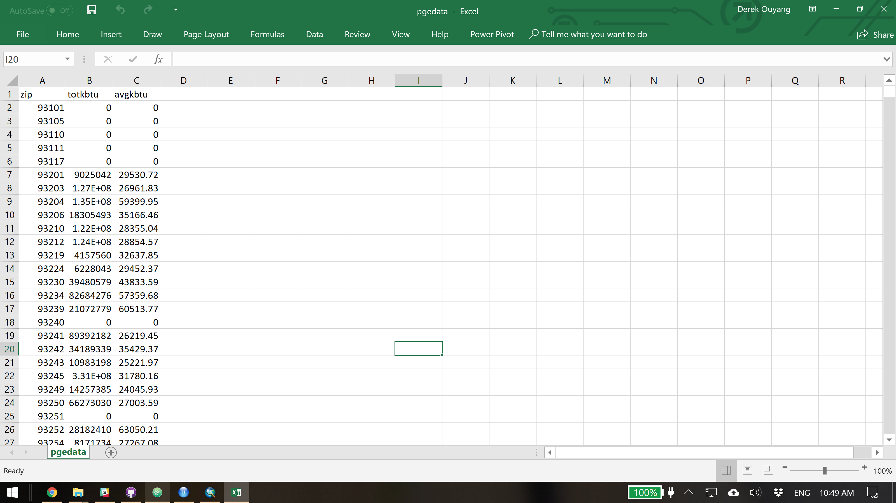

9. Also save your final Excel (.xlsx) file to your repository.

#### Q5: Explain your choice of formula for "avgkbtu".

9. In order to map this zip code data, we’re going to need zip code shapes. We’ll use SimplyAnalytics, an online database accessible to Stanford students, to grab these shapes, although the true value of SimplyAnalytics won’t be realized until later. <a href="http://simplyanalytics.com">Log on to SimplyAnalytics</a> (Note that if you are off-campus, you should use <a href="https://app-simplyanalytics-com.stanford.idm.oclc.org/index.html">this link</a> instead). If this is your first time using the tool, we recommend going through the on-boarding tour and the 5-minute introduction video within the Support tab. Once you have a Project, complete the following:
	1. Add Location: California
	2. Add Data: Anything will do for now; select Population
	3. View Map (right toolbar)
	4. View Actions > Export Shapefile, Select Zip Codes in CA, Population data
	5. You will be emailed a download link; for convenience, we have provided a copy of what you would download in S:\CEE224X\A1\Data as well.

	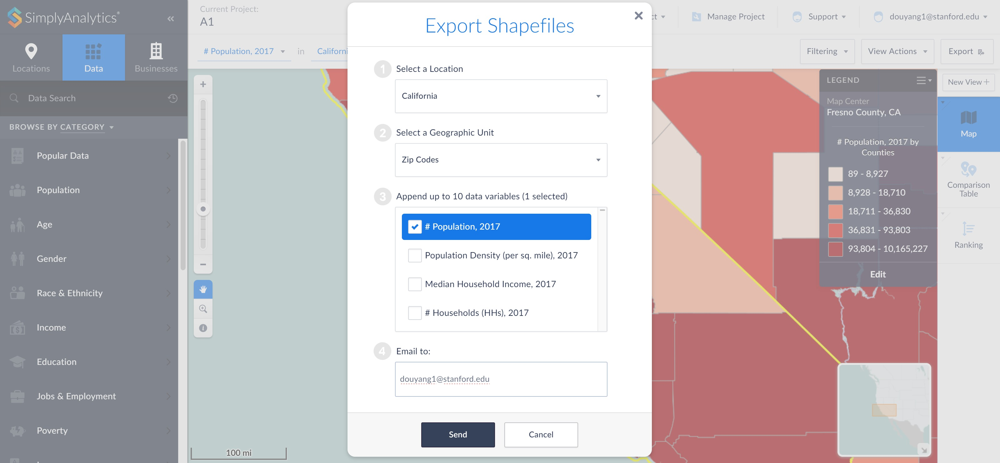

10. Now we will create our own GIS map of the PG&E data. Start ArcMap and create a blank map. As soon as the blank page shows, Save your ArcMap document (.mxd file) and save regularly throughout the next few steps. ArcMap is the kind of software that crashes after three hours of unsaved work to spite you.

	

11. On the far right toolbar you should be able to click on "Catalog". Right click on "Folder Connections" and select "Connect to Folder". You should connect to both S:\CEE224X\A1\Data and your GitHub folder.

	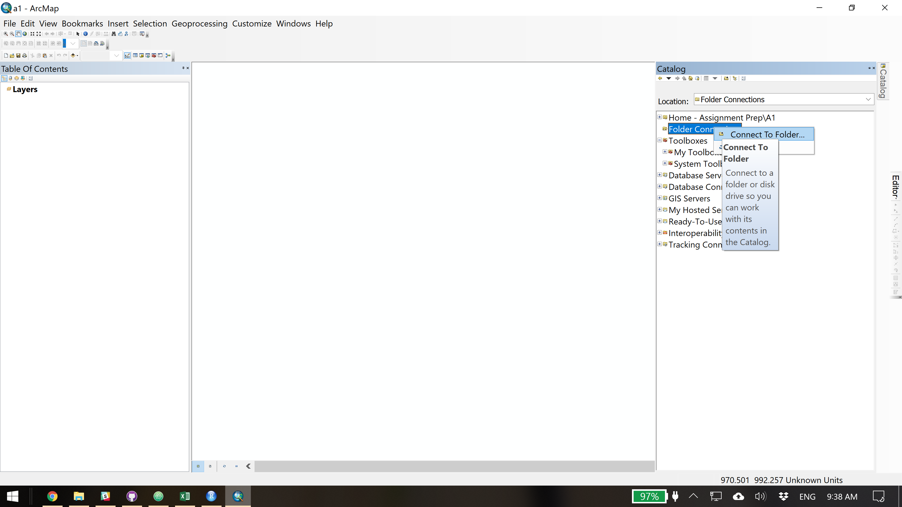

12. File > Add Data > Add Basemap. Select the "Streets" basemap or another one of your preference.

	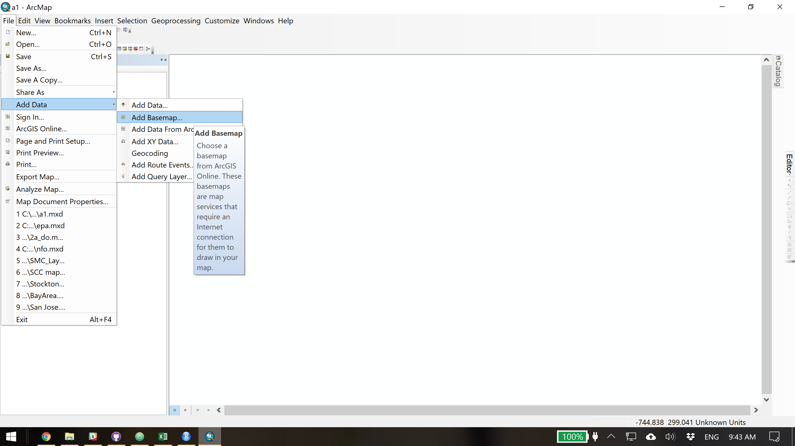

13. Add your SimplyAnalytics zip code shapefile (.shp). Shapefiles are the kind of data file that you can't really see on your normal file explorer -- only in the Catalog. You should be able to navigate down to S:\CEE224X\A1\Data\ca_zips and find a "ca_zips.shp" file. Drag that into the Layers tree under "Table of Contents" on the left, or onto the map area itself. Right-click on ca_zips in your Table of Contents and select "Zoom to Layer" to get a better view. This is a big file so be patient with it loading. After you've appreciated the size of the file, then you may want to un-check the ca_zips layer so you don't have to continuously redraw it.

	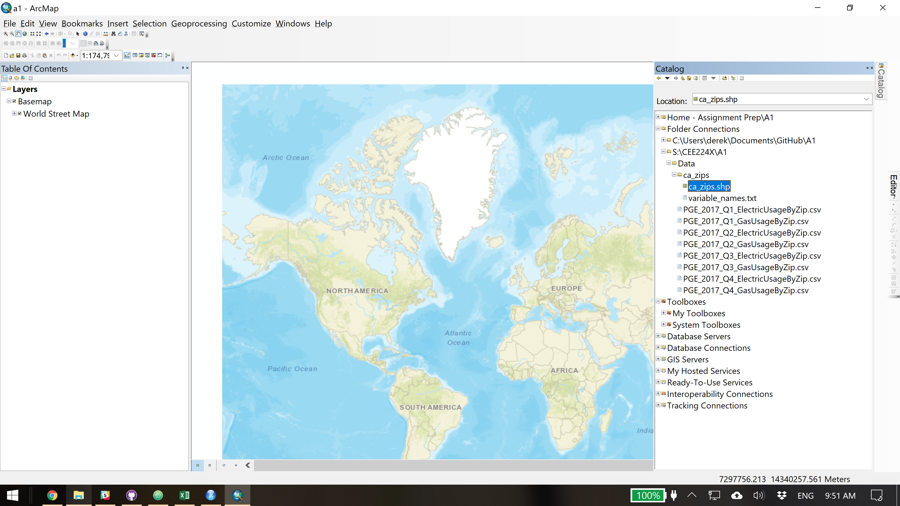

	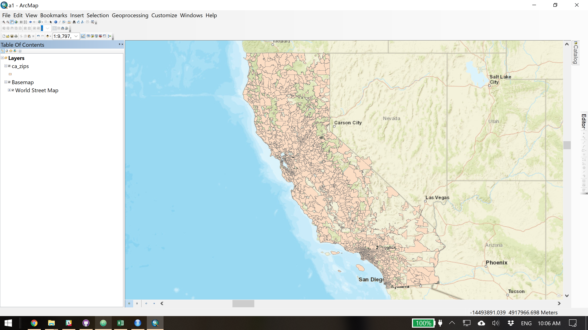

14. One of the classic chores on ArcMap is converting numbers stored as "strings" into real "numbers". In the case of SimplyAnalytics, any shapes you download will likely need this conversion done to their relevant IDs, in this case zip code. Right click on "ca_zips" and select "Open Attribute Table". Click the button on the top left of the attribute table and select "Add Field". Name the field "zip" and make sure to set the data type as "double". This should be your default choice almost always.

	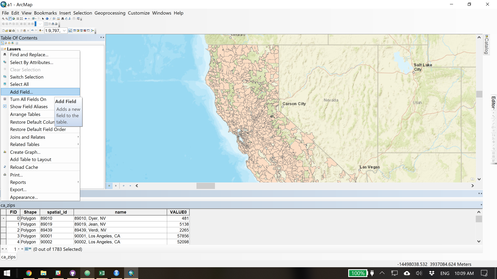

15. Right-click on the header of your new "zip" field and select "Field Calculator". Using this tool you'll be able to set the contents of "zip" to be a wide array of results based on the contents of other fields. In our case we just want "zip" to be equivalent to the existing "spatial_id" field, but for the data to be stored as double instead of string. Just double click on "spatial_id" and click OK. This may take a while.

	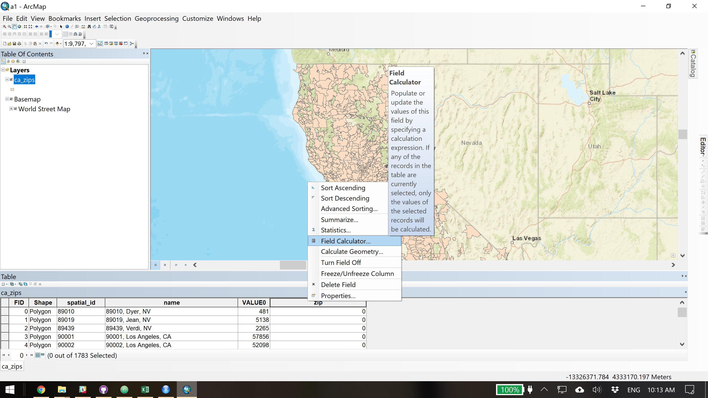

	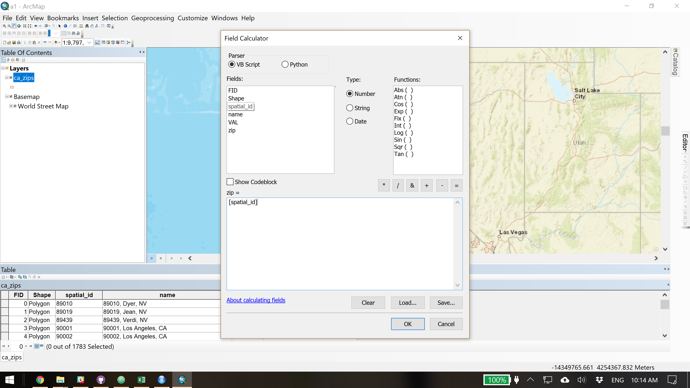

16. Now we will join our PG&E data (prepared as a CSV) to our SimplyAnalytics zip code shapes. The "link" we've created is the "zip" field that shows up in both datasets. Note that if you hadn't converted the string to double in the previous two steps, this join will not work. Right-click on ca_zips in the Table of Contents and select "Joins and Relates" > "Join". 1. Choose "zip". 2. Navigate in your browser to your PG&E CSV. 3. Choose "zip". Also select "Keep only matching records". Click OK.

	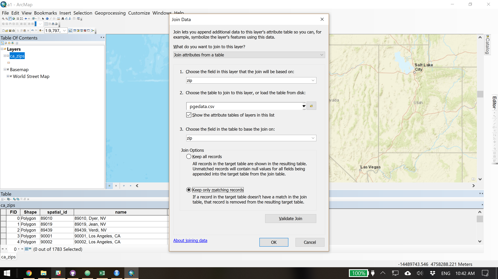

17. In the attribute table, you should now be able to confirm that there are new fields appended to ca_zips from Excel.

18. Now let's view "totkbtu" as a color range on the map. Right-click on ca_zips, select "Properties", and select the "Symbology" tab. Switch to "Quantities" on the left and then select "totkbtu" from the dropdown menu. ArcMap will automatically create 5 brackets based on a statistical method called <a href="http://wiki.gis.com/wiki/index.php/Jenks_Natural_Breaks_Classification">Jenks Natural Breaks Classification</a>. 5 is a good maximum number of colors because normal eyes will find any larger number of similar colors difficult to distinguish. Jenks is a useful classification type, but you can also select any number of other classification methods or set your own intervals. A few other things to do before finishing:

	1. You can pick your own color ramp.
	2. You can exclude shapes from the visualization where "totkbtu" has a value of 0. Select "Classify" and "Exclusion". You'll see the familiar Field Calculator -style window. Double-click on "totkbtu" and then complete the expression to show "[totkbtu] = 0". Click OK.
	3. For clarity, it's helpful to round your interval brackets to 2 significant figures. Right-click on "Label" above the shown intervals and select "Format Labels". Under "Numeric", select Rounding to "Number of significant digits" and select 2. Click OK.

	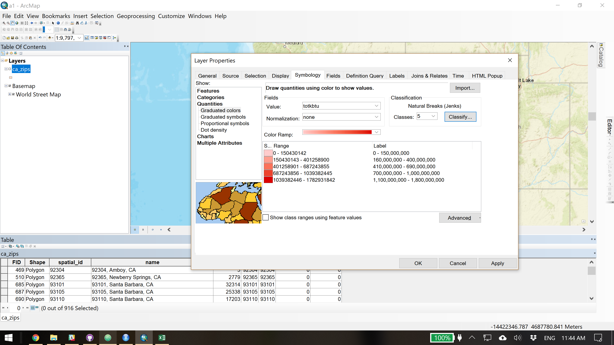

19. You should now see a much more informative map. Zoom to Layer again and make a bookmark at Bookmarks > Create Bookmark.

20. Switch to View > Layout View. Generally the most useful kind of export is to a slide deck, so you will want to set your data frame (the bounding box for viewed data) and your map page size (the bounding box for what gets exported) to both be 16 wide by 9 high. I find a 16 inches by 9 inches JPEG or PNG to be plenty large resolution for most exporting needs.

	1. To set your data frame, right-click on "Layers" in the Table of Contents and select "Properties". Go to "Size and Position" and type in 16 in for width and 9 in for height, and 0 in for offset.
	2. To se your map page size, go to File > Page and Print Setup and manually set the Map Page Size to 16 in and 9 in.

	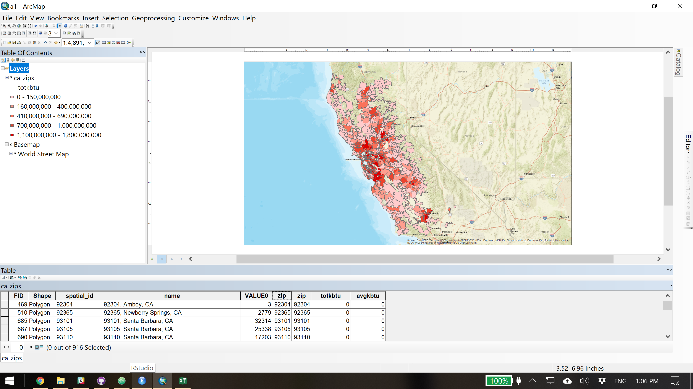

21. Insert > Legend. Include only "ca_zips" in Legend Items. Go through the steps shown to end up with a legend that shows "totkbtu" intervals overlaid on your data frame.

22. File > Export > Save as PNG.

23. In your 224X Google Drive folder, create a new Slides file and insert your exported map. You should be able to align the image exactly with the frame of the slide.

24. Back to ArcMap, Right-click on "ca_zips" and "Copy". Right-click on "Layers" and "Paste Layers". You should now see two identical instsances of "ca_zips" in your Table of Contents. For one of them, set it so that it's the only one visible, then change the symbology to view "avgkbtu" instead. Repeat the steps above so you end up with a second slide that has the exact same data frame extent, but is visualizing average kBTU per customer instead.

25. Return to Data View. Select a specific zip code for inspection: if you live in PG&E territory then use your own zip code; otherwise pick 94305 for Stanford. You can search for the zip code directly in your attribute table using Ctrl+F or Command+F. Right-click on the data row and select "Zoom to Selected". Zoom out until you can see a useful vicinity. Save as a second bookmark, and repeat the steps above so you have 2 more exported images, of "totkbtu" and "avgkbtu", for the zoomed-in view. You should end up with 4 slides.

26. Save your map document (.mxd) to your GitHub folder.

#### Q6 Paste a publicly viewable link to your Slides.

#### Q7 In what ways do the results in or in the vicinity of your chosen zip code validate or contradict your expectations?

#### Q8 Any other reactions to completing Pass One? What was especially challenging or surprising in the workflow? How might you expand on this analysis if you had more time?

### Second Pass: R/Python

Now that you've produced some basic insights about the PG&E data using a "manual" approach, you are encouraged to try completing the same results using R or Python. If you do not wish to try your hand at writing the script yourself, skip to Step 2.

1. If you want to try writing a script in R or Python, we recommend you look at the pseudocode below, and then as soon as you're stuck, refer to the completed versions of code in the repository, which have plenty of explainers within. Since most programming is fundamentally copying open source content online, it is perfectly fine to learn from completed code, as long as you are diligently understanding each line.

	1. Load useful libraries.
	2. Load the csvs and combine them in long format. You’ll likely want to convert kWh and thm fields into kBTU before you append the two datasets.
	3. Filter out non-residential customers.
	4. Find total energy usage for all zip codes by month by customer class. In R/P syntax, you’ll want to use the group_by functions.
	5. Once you have monthly energy totals by customer class, you can make a bar plot. Make sure to use the same units when plotting the bar plot.
	6. Create a dataframe that has yearly average energy use for each zip code. You’ll again want to use a group_by function to aggregate the data at the zip code level.
	7. Load the SimplyAnalytics zip code shapefiles.
	8. Join the shapefile and PG&E data together using zip codes as the common ID.
	9. Use a mapping plug-in to create an interactive map of the zip code data over a basemap. Set up 5 class intervals using Jenks Natural Breaks. For Python, convert geodataframe to json format and save the map as an HTML file.

2. Open "A1_completed.Rmd" in RStudio. If the upper left pane appears to be empty, try File > Reopen with Encoding and select "UTF-8". Go to Tools > Install Packages and insert the following string: `rmarkdown knitr stringi magrittr readr dplyr ggplot2 tidyr scales rgdal sp classInt RColorBrewer rgeos ggmap mapview`. Check "Install dependencies" and click Install. Try running the script by clicking Run > Run All. You'll know it's complete when you see a map under "Viewer" in the bottom right pane. If an error comes up noting that any other packages are missing, then just go ahead and install those using the same steps.

3. Now we will convert your script (either one you've written yourself or A1_completed.Rmd) into HTML.

	1. For .Rmd files, select Knit > Knit to HTML. This will create an an HTML file in your working folder.
	2. For .ipnyb files, select File > Download As > HTML. The final map may be too large to process within Jupyter, so the code

4. Using the steps outlined in Part 1, upload this HTML to your personal Stanford WWW directory. If you can view the completed file on `http://web.stanford.edu/*~yoursunetid*/A1`, then you are done with Pass Two.

#### Q9 How would you compare the experienced or apparent work involved, as well as the usefulness of the outcome, of Pass One vs. Pass Two? How would you rate the difficulty of this assignment?

#### Q10 In total, how long did Assignment 1 take?
